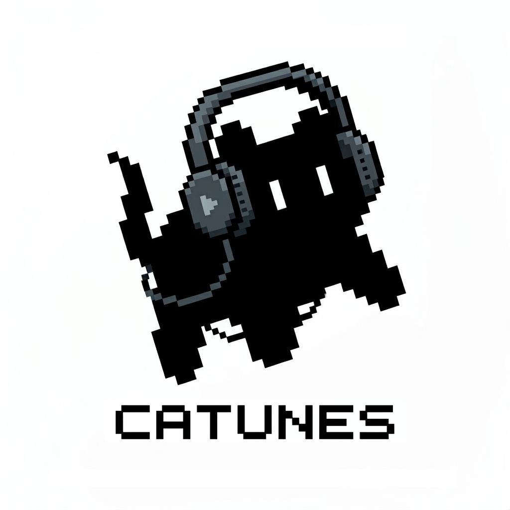

# 🎵 CATUNES — Premium Android Music Player

<p align="center">
  
</p>

<p align="center">
  <a href="https://developer.android.com"></a>
  <a href="https://kotlinlang.org"></a>
  <a href="https://developer.android.com/jetpack/compose"></a>
  <a href="https://github.com/google/ExoPlayer"></a>
  <a href="https://github.com/features/actions"></a>
</p>

---

**CATUNES** is a local music player for Android designed with **Material Design 3** guidelines and a comprehensive audio engine powered by **Media3/ExoPlayer**.

---

## ✨ Features (Already Implemented)

- 📂 **Folder Access (SAF)**: Add and manage multiple music folders (including external SD cards) without granting full access to your entire internal storage.
- 🔍 **Search with Chips**: Instantly filter your library by **Song, Artist, or Album**.
- 🍒 **Synchronized Lyrics (.lrc)**: Full support for real-time dynamic scrolling and auto-scroll of detected synchronized lyrics alongside the music.
- 🔀 **Shuffle & Repeat Controls**: Fully integrated native Media3 shuffle and repeat modes, available in both the main player and the MiniPlayer.
- 🎛️ **Native Equalizer**: Fine-tune audio adjustments via built-in sliders to customize your favorite frequencies.
- 🔊 **Stable Volume (Audio Normalization)**: Smart built-in normalization using `LoudnessEnhancer` to prevent sudden level changes between tracks.
- 💫 **MiniPlayer**: Floating bottom bar with optimized transitions and dynamic gestures, visible throughout navigation.
- 🎨 **Personalization Settings**:
  - Dynamic accent color selector.
  - Theme toggler (Dark Mode, Light Mode, or System Synced).
  - Global font scale multiplier for readability.
- 🚗 **Automotive Connection (Bluetooth Metadata)**: Native transmission of cover art and metadata (Title, Artist, Album) to vehicles or external devices via AVRCP profiles with legacy playback controls.

---

## 🛠️ Stack

- **Language**: [Kotlin](https://kotlinlang.org/) (Coroutines, StateFlow)
- **UI**: [Jetpack Compose](https://developer.android.com/jetpack/compose) with smooth animations (`tween`).
- **Database**: [Room Database](https://developer.android.com/training/data-storage/room) for fast offline metadata indexing.
- **Audio Engine**: [Jetpack Media3](https://developer.android.com/guide/topics/media/media3) (`ExoPlayer` + `MediaSession` + `MediaSessionService`).
- **Persistence**: [DataStore Preferences](https://developer.android.com/topic/libraries/architecture/datastore) for user settings.
- **Image Loading**: [Coil](https://github.com/coil-kt/coil) for album art loading from the internal cache.

---

## 💻 Compilation & Installation Guide

### 1. Prerequisites
* [Android Studio Koala](https://developer.android.com/studio) or higher.
* JDK 17 (automatically bundled with Android Studio).
* A device running Android 8.0 (API 26) or higher with USB Debugging enabled, or an emulator.

### 2. Clone and Compile
Open a terminal and run:
```bash
git clone https://github.com/oron8/catunes.git
cd catunes
./gradlew.bat assembleDebug
```
The installable APK will be located at:  
`app/build/outputs/apk/debug/app-debug.apk`

---

### LICENSE

This project is licensed under the **CATUNES Open Source Non-Commercial License (COSNCL) v1.0**.

See the [LICENSE](LICENSE) file for more details. In summary:
* **Non-commercial Use**: You can use, study, modify, fork, and redistribute the software freely as long as it is for non-commercial purposes.
* **Attribution Required**: You must include clear credits to **Oron_8** in any copy or derivative work.
* **No Warranty**: The software is provided "as is", without warranty of any kind.
